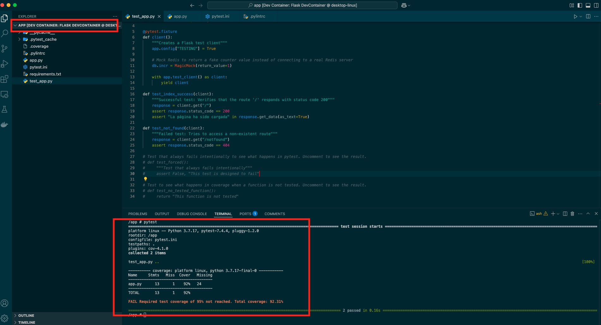
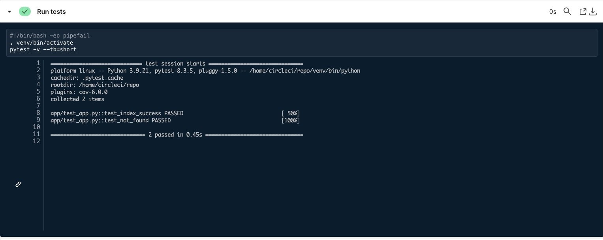
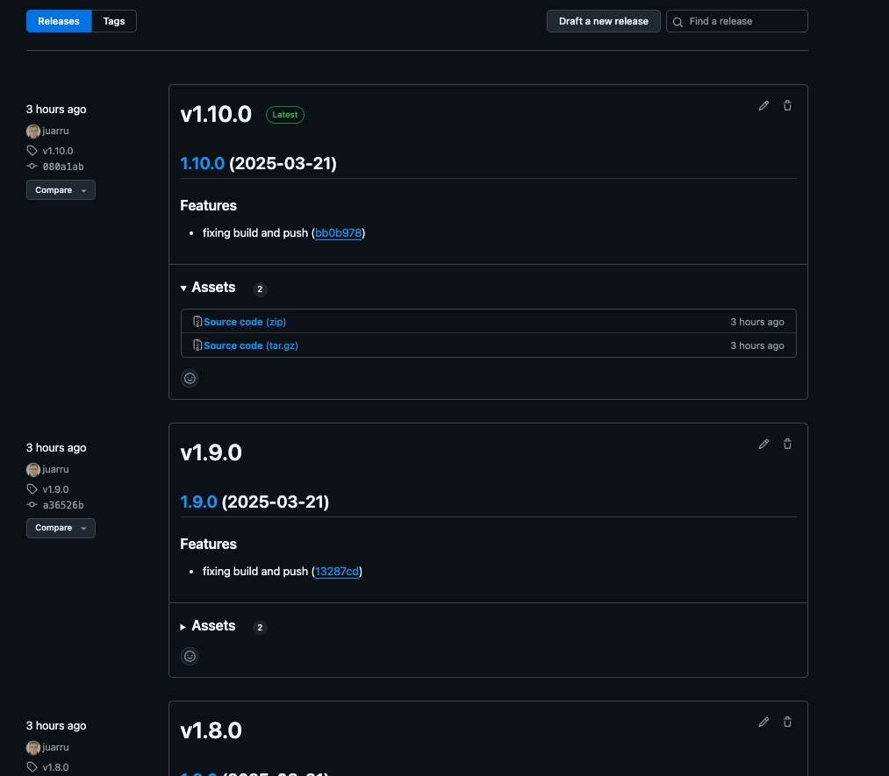
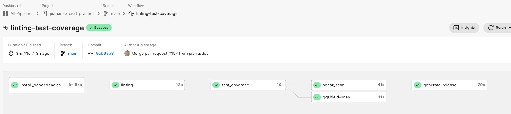
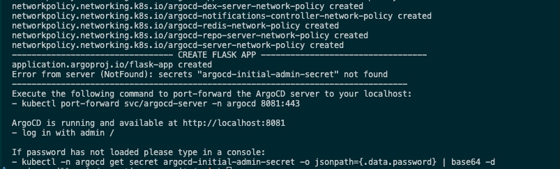
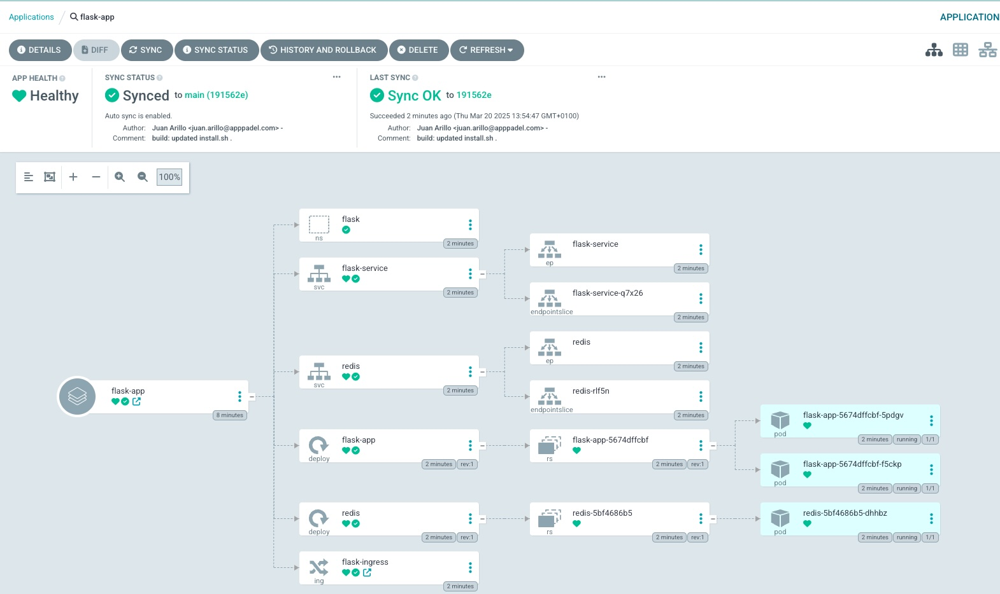

# PRÁCTICA CICLO DE VIDA DE UN DESARROLLO - CICD - JUAN ARILLO

Práctica de Juan Arillo para el módulo de **Ciclo de vida de un desarrollo - CICD**.

## TABLA DE CONTENIDOS

- [Descripción](#descripción)  
- [Recursos](#recursos)  
- [Desarrollo y construcción de la imagen de la aplicación](#desarrollo-y-construcción-de-la-imagen-de-la-aplicación)
  - [Gitflow](#gitflow)  
  - [Preparación para desarrollo](#preparación-para-desarrollo)  
  - [PR a dev](#pr-a-dev)
  - [CircleCI pipeline en dev](#circleci-pipeline-en-dev)
  - [PR en main](#pr-en-main)
  - [CircleCI pipeline en main](#circleci-pipeline-en-main)
- [Despliegue de la aplicación](#despliegue-de-la-aplicación)
  - [Clonación del proyecto](#clonación-del-proyecto)
  - [Despliegue automático](#despliegue-automático)
  - [Acceso a la aplicación](#acceso-a-la-aplicación)

## DESCRIPCIÓN

Este es el repositorio central para la práctica del **Ciclo de vida de un desarrollo - CICD**, en el cual se despliega una aplicación *Flask* conectada a una base de datos *Redis*, usando manifiestos de *Kubernetes* en una infraestructura local con *Kind* usando *ArgoCD*.  

La aplicación *Flask* muestra un texto con el número de veces que se ha cargado la página principal de la aplicación. La imagen de la aplicación *Flask* está en un repositorio personal de docker hub ([*Docker hub*](https://hub.docker.com/repository/docker/juanarillo/cicd_practica/general)).

El servicio de la base de datos *Redis*, sirve como persistencia del número de veces que se visita la página principal
de la aplicación.

A través de *Kind* creamos un cluster local de Kubernetes, que nos permitirá desplegar de manera automática la herramienta *ArgoCD* para la entrega continua de despliegues de *Kubernetes*, y la aplicación *Flask* ya desplegada, a través de un fichero *bash* `install.sh`.

## RECURSOS

La práctica está compuesta de los siguientes repositorios y proyectos:

- Repositorio del código de la aplicación -> <https://github.com/juarru/juanarillo_cicd_practica>  
- Repositorio de los artefactos de la release -> <https://github.com/juarru/juanarillo_cicd_practica/releases>  
- Repositorio de las imágenes generadas -> <https://hub.docker.com/repository/docker/juanarillo/cicd_practica/general>
- Proyecto de CircleCI -> <https://app.circleci.com/pipelines/github/juarru/juanarillo_cicd_practica>
- Proyecto de Codecov -> <https://app.codecov.io/gh/juarru/juanarillo_cicd_practica>
- Proyecto de Sonarqube -> <https://sonarcloud.io/summary/overall?id=juarru_juanarillo_cicd_practica&branch=main>
- Repositorio de la infraestructura de despliegue -> <https://github.com/juarru/juanarillo_cicd_practica_argo>  

> **Nota:** En el `README.md` del repositorio de código y del repositorio de infraestructura, se encontrarán las instrucciones para su uso.

## DESARROLLO Y CONSTRUCCIÓN DE LA IMAGEN DE LA APLICACIÓN

### Gitflow

Se ha establecido el proyecto para realizar un *Gitflow* simple, con una rama principal **main** y una rama de desarrollo - pruebas **dev**.


El Desarrollador debe de sacar una rama de **dev** con un nombre indicativo de la tarea a realizar, donde realizará las acciones oportunas.

Una vez el Desarrollador termine el trabajo, subirá la rama al repositorio y abrirá un *Pull Request* de la rama subida **sobre la rama dev** en el *repositorio de Github* de manera manual.  

Al realizar el *Pull Request* se activarán unas *Github Actions* que realizarán unos checks de linting, testeo, cobertura, análisis estático y análisis de vulnerabilidades, para poder mergear con seguridad a la rama *dev*.

Una vez realizado este mergeo, se lanzarán unos checks de linting, testeo y cobertura en un pipeline de *CircleCI*.

Cuando se quiera desplegar a producción, se realizará de manera manual en el *repositorio de Github*, un *Pull Request* **de la rama dev sobre la rama main**. En este *Pull Request* nos aparecerán los checks que se realizaron con *CircleCI*, y se volverán a ejecutar los checks de *Github Actions*.

Si todo es correcto y se mergea, se lanzará un pipeline de *CircleCI* con los checks anteriores, una generación de release, la construcción y el taggeo de la imagen de la aplicación y su subida al repositorio de *Docker Hub*.  

### Preparación para desarrollo

- El Desarrollador se clonará el repositorio donde se encuentra la aplicación.

```bash
git clone https://github.com/juarru/juanarillo_cicd_practica.git
```

- Se situará dentro del repositorio y, desde la rama dev, creará una nueva rama para desarrollar su tarea.

```bash
cd juanarillo_cicd_practica
git checkout dev
git checkout -b feature/mi_nueva_feature
```

- Trabajará con su IDE para desarrollar su tarea. Si el Desarrollador usa *Visual Studio Code*, se han creado unas configuraciones que le desplegarán un proyecto en local con la base de datos y todo, y así poder hacer también checks en local.



### PR a dev

- Una vez el Desarrollador ha terminado su trabajo, subirá su rama al repositorio.

```bash
git add .
git commit -am "feat: Lo que haya hecho"
git push --set-upstream origin feature/mi_nueva_feature
```

- El Desarrollador accede al repositorio de Github y crear un *Pull Request* para mergear la rama subida **con la rama dev**.


- Al crear el *Pull Request*, se dispararán unos checks que se han creado con *Github Actions*


- Una vez terminado la comprobación, si todo es correcto, se puede mergear a dev.

### CircleCI pipeline en dev

Al realizar la acción de mergeo en dev, se activará un pipeline de *CircleCI* que realizará las siguientes acciones:

- Instala las dependencias del proyecto *Flask*, a partir del fichero `requirements.txt`.
- Realizar el linting del proyecto con *pylint*.  
- Realiza los tests y el coverage con *pytest*.




- Sube un reporte a *Codecov*.


- Realiza un análisis de vulnerabilidades con *ggshield*.


### PR en main

- Cuando se desee generar una nueva versión de producción, se realizará un *Pull Request* desde el repositorio de *Github*, desde la rama *dev* a la rama *main*. 


- Al crear este *Pull Request*, se volverán a disparar los checks de dev a través de *Github Actions*, y tendremos los checks realizados en el pipeline de *CircleCI*.


- Cuando hayan acabado las comprobaciones, si todo es correcto, se puede mergear a main.

### CircleCI pipeline en main

Al realizar la acción de mergeo en main, se activará un pipeline de *CircleCI* que realizará las siguientes acciones:

- Instala las dependencias del proyecto *Flask*, a partir del fichero `requirements.txt`.
- Realizar el linting del proyecto con *pylint*.  
- Realiza los tests y el coverage con *pytest*.


- Sube un reporte a *Codecov*


- Realiza un análisis de vulnerabilidades con *ggshield*.
- Realiza un análisis con [*SonarQube*](https://sonarcloud.io/summary/overall?id=juarru_juanarillo_cicd_practica&branch=main) y sube los resultados al proyecto vinculado en la página.


- Genera el nuevo TAG y crea la release en el repositorio de [*Github*](https://github.com/juarru/juanarillo_cicd_practica/releases) con su Changelog y guardando los assets de la release.



- Construye la imagen de la aplicación, y la sube a [*Dockerhub*](https://hub.docker.com/repository/docker/juanarillo/cicd_practica/general) con su nuevo TAG y actualiza el TAG `latest`.


- Termina el pipeline de construcción y envío al repo.



## DESPLIEGUE DE LA APLICACIÓN

En esta sección se explican los pasos para desplegar la aplicación *Flask* en un cluster de *Kubernetes* usando *Kind* y *ArgoCD*.

### Clonación del proyecto

Para proceder a la creación del cluster y despliegue de la aplicación, clonaremos el repositorio que se encuentra en *Github*, y nos situamos dentro de la carpeta del proyecto.

```bash
git clone https://github.com/juarru/juanarillo_cicd_practica_argo.git
cd juanarillo_cicd_practica_argo
```

### Despliegue automático

Existe un fichero `install.sh` que realiza casi todo el proceso de manera automática. Damos permisos al fichero para poder ejecutarse y lo lanzamos.

```bash
sudo chmod +x install.sh
./install.sh
```

Se ejecutarán todas las acciones, y se devolverá al final una serie de instrucciones que hay que seguir para terminar con el proceso.



Como se indica en la salida del despliegue, ahora habrá que realizar los siguientes pasos:

- Hacer el *port-forward* para poder acceder a *ArgoCD*. Mantenerlo en ejecución.

```kubectl
kubectl port-forward svc/argocd-server -n argocd 8081:443
```

- Si no ha dado tiempo a desplegar el pod de *ArgoCD*, habrá fallado la devolución del password. Realizar la instrucción que se indica en la salida del ejecutable.

```kubectl
kubectl -n argocd get secret argocd-initial-admin-secret -o jsonpath={.data.password} | base64 -d
```

- Ahora podemos acceder a *ArgoCD* en la dirección `http://localhost:8081`


- La aplicación aparecerá desplegada.



### Acceso a la aplicación

Para ver la aplicación funcionando, primero habrá que editar el fichero `hosts` de su máquina, y añadir la siguiente línea:

```bash
127.0.0.1       flask.local
```

Una vez configurado esto, podemos acceder a la aplicación de dos maneras diferentes:

- Escribir `http://flask.local` en el navegador.

- Acceder desde *ArgoCD*


Si todo es correcto, se podrá acceder a la aplicación.


