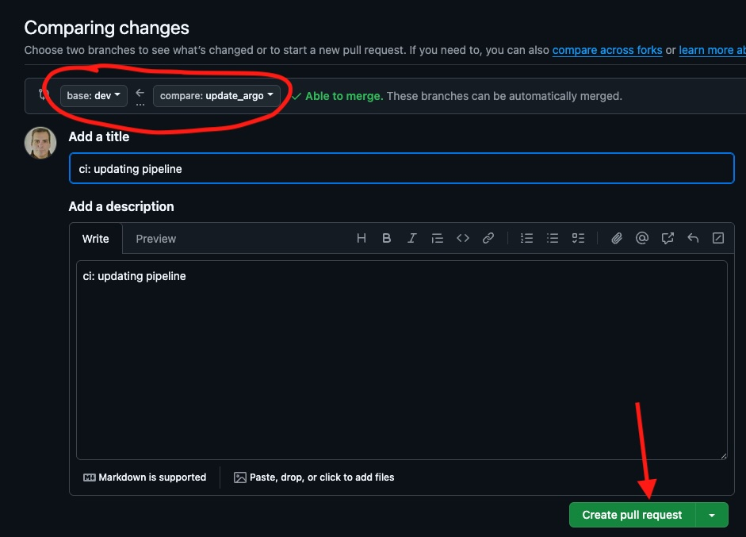

# PRÁCTICA CICLO DE VIDA DE UN DESARROLLO - CICD - JUAN ARILLO

Práctica de Juan Arillo para el módulo de **Ciclo de vida de un desarrollo - CICD**.

## TABLA DE CONTENIDOS

- [Descripción](#descripción)  
- [Recursos](#recursos)  
- [Desarrollo de la práctica](#desarrollo-de-la-práctica)
  - [Gitflow](#gitflow)  
  - [Preparación para desarrollo](#preparación-para-desarrollo)  
  - [PR a dev](#pr-a-dev)
  - [CircleCI pipeline](#circleci-pipeline)

## DESCRIPCIÓN

Este es el repositorio central para la práctica del **Ciclo de vida de un desarrollo - CICD**, en el cual se despliega una aplicación *Flask* conectada a una base de datos *Redis*, usando manifiestos de *Kubernetes* en una infraestructura local con *Kind* usando *ArgoCD*.  

La aplicación *Flask* muestra un texto con el número de veces que se ha cargado la página principal de la aplicación. La imagen de la aplicación *Flask* está en un repositorio personal de docker hub ([*Docker hub*](https://hub.docker.com/repository/docker/juanarillo/cicd_practica/general)).

El servicio de la base de datos *Redis*, sirve como persistencia del número de veces que se visita la página principal
de la aplicación.

A través de *Kind* creamos un cluster local de Kubernetes, que nos permitirá desplegar de manera automática la herramienta *ArgoCD* para la entrega continua de despliegues de *Kubernetes*, y la aplicación *Flask* ya desplegada, a través de un fichero *bash* `install.sh`.

## RECURSOS

La práctica está compuesta de los siguientes repositorios y proyectos:

- Repositorio del código de la aplicación -> <https://github.com/juarru/juanarillo_cicd_practica>  
- Repositorio de los artefactos de la release -> <https://github.com/juarru/juanarillo_cicd_practica/releases>  
- Repositorio de las imágenes generadas -> <https://hub.docker.com/repository/docker/juanarillo/cicd_practica/general>
- Proyecto de CircleCI -> <https://app.circleci.com/pipelines/github/juarru/juanarillo_cicd_practica>
- Proyecto de Sonarqube -> <https://sonarcloud.io/summary/overall?id=juarru_juanarillo_cicd_practica&branch=main>
- Repositorio de la infraestructura de despliegue -> <https://github.com/juarru/juanarillo_cicd_practica_argo>  

> **Nota:** En el `README.md` del repositorio de código y del repositorio de infraestructura, se encontrarán las instrucciones para su uso.

## DESARROLLO DE LA PRÁCTICA

### Gitflow

Se ha establecido el proyecto para realizar un *Gitflow* simple, con una rama principal **main** y una rama de desarrollo - pruebas **dev**.


El Desarrollador debe de sacar una rama de **dev** con un nombre indicativo de la tarea a realizar, donde realizará las acciones oportunas.

Una vez el Desarrollador termine el trabajo, subirá la rama al repositorio y abrirá un *Pull Request* de la rama subida **sobre la rama dev** en el *repositorio de Github* de manera manual.  

Al realizar el *Pull Request* se activarán unas *Github Actions* que realizarán unos checks de linting, testeo, cobertura, análisis estático y análisis de vulnerabilidades, para poder mergear con seguridad a la rama *dev*.

Una vez realizado este mergeo, se lanzarán unos checks de linting, testeo y cobertura en un pipeline de *CircleCI*.

Cuando se quiera desplegar a producción, se realizará de manera manual en el *repositorio de Github*, un *Pull Request* **de la rama dev sobre la rama main**. En este *Pull Request* nos aparecerán los checks que se realizaron con *CircleCI*, y se volverán a ejecutar los checks de *Github Actions*.

Si todo es correcto y se mergea, se lanzará un pipeline de *CircleCI* con los checks anteriores, una generación de release, la construcción y el taggeo de la imagen de la aplicación y su subida al repositorio de *Docker Hub*.  

### Preparación para desarrollo

- El Desarrollador se clonará el repositorio donde se encuentra la aplicación.

```bash
git clone https://github.com/juarru/juanarillo_cicd_practica.git
```

- Se situará dentro del repositorio y, desde la rama dev, creará una nueva rama para desarrollar su tarea.

```bash
cd juanarillo_cicd_practica
git checkout dev
git checkout -b feature/mi_nueva_feature
```

- Trabajará con su IDE para desarrollar su tarea. Si el Desarrollador usa *Visual Studio Code*, se han creado unas configuraciones que le desplegarán un proyecto en local con la base de datos y todo, y así poder hacer también checks en local.


### PR a dev

- Una vez el Desarrollador ha terminado su trabajo, subirá su rama al repositorio.

```bash
git add .
git commit -am "feat: Lo que haya hecho"
git push --set-upstream origin feature/mi_nueva_feature
```

- El Desarrollador accede al repositorio de Github y crear un *Pull Request* para mergear la rama subida **con la rama dev**.



- Al crear el *Pull Request*, se dispararán unos checks que se han creado con *Github Actions*


- Una vez terminado la comprobación, si todo es correcto, se puede mergear a dev.

### CircleCI pipeline

